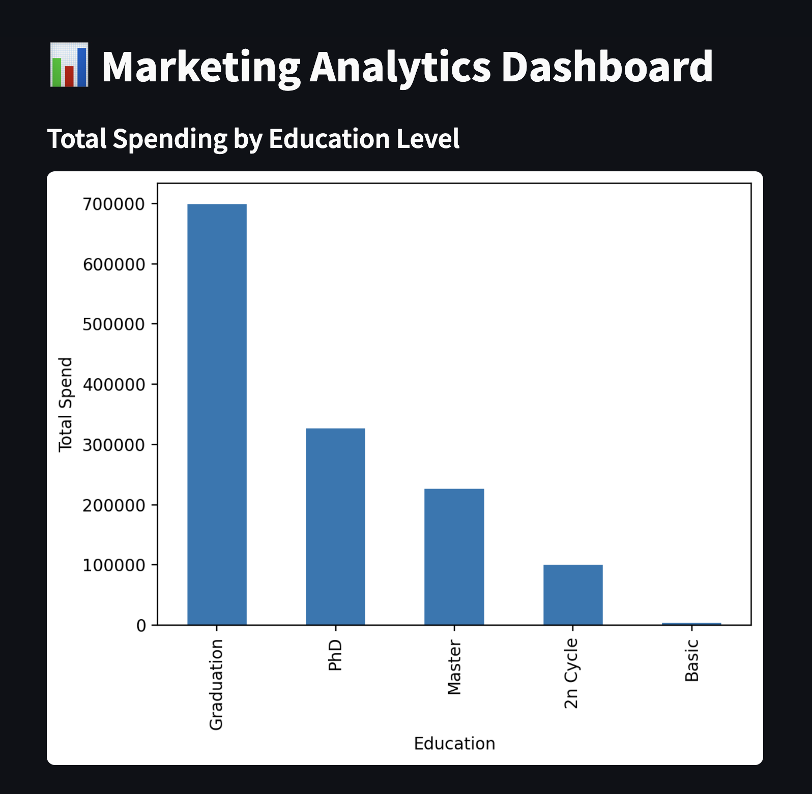
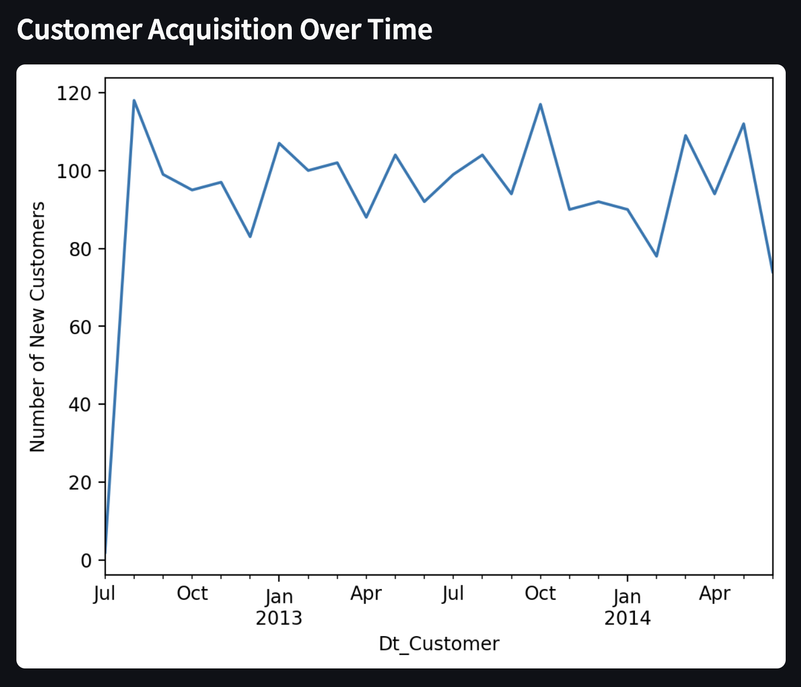
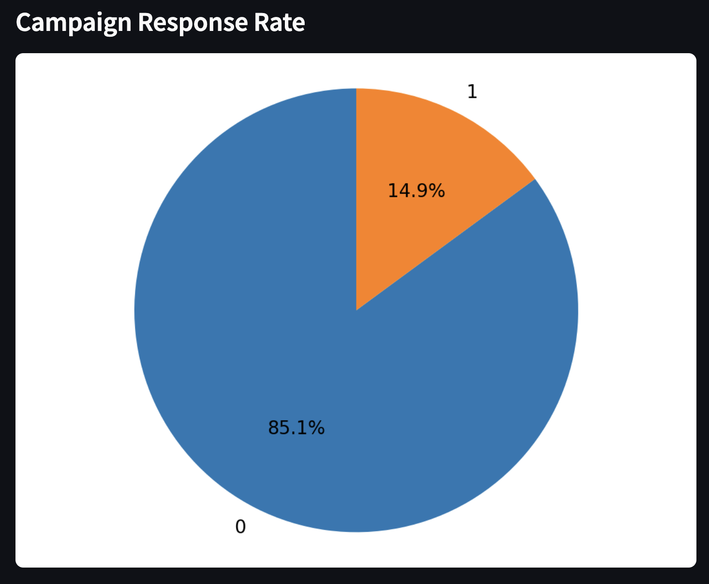

# Marketing Analytics Dashboard — ETL Project
This project simulates a real-world marketing analytics pipeline for a SaaS or product-based company. It uses the **Marketing Campaign Dataset** to build a complete **ETL (Extract-Transform-Load)** workflow using Python and pandas.

## Goal
To extract insights from marketing campaign data to inform customer segmentation, product targeting, and business decisions — similar to tasks expected in data engineering roles at companies like **Canonical**.

## Features
- ETL pipeline in modular Python scripts
- Smart missing value imputation (group-level based on Education & Marital Status)
- Feature engineering: customer lifetime, total kids, total spend
- Correlation analysis between income, spend, and engagement
- Clean dataset ready for dashboarding or machine learning

## Dashboard: Marketing Analytics Overview
Built using Apache Superset  
This dashboard includes:

- Total spending segmented by education level
- Customer acquisition trend over time
- Campaign response rate (conversion percentage)

## 📊 EDA Visualizations
Some initial insights before modeling:

### 1. Average Spending by Marital Status

### 2. Income Distribution

### 3. Correlation: What Drives Total Spending?

## 📊 Dashboard: Marketing Analytics Overview (Streamlit)
pip install streamlit
streamlit run streamlit_app/dashboard.py

Built using Streamlit  
Includes:
- Total spending by education
- Customer acquisition trend
- Campaign response rate

## Superset (for environment issues, I stopped Superset)
deactivate
cd ~
source superset-env/bin/activate
superset run -p 8088
http://localhost:8088, log in
Optional:
pip install apache-superset
superset db upgrade
superset init
superset run -p 8088 --with-threads --reload --debugger

## 🎯 Model Evaluation: Predictive Modeling – Campaign Response Classifier

We trained models to predict whether a customer will respond to a campaign (Response = 1).
1. Baseline Models

We started with two baseline classifiers:

- Logistic Regression

- Random Forest

Performance on test set:
Model	Accuracy	Precision (1)	Recall (1)	F1-score (1)
Logistic Regression	86%	0.67	0.23	0.34
Random Forest	87%	0.66	0.30	0.42

 Both models performed well for majority class (non-responders), but poorly on minority class (responders).

2. Class Imbalance Handling – SMOTE

We used SMOTE (Synthetic Minority Over-sampling Technique) to generate synthetic samples for underrepresented responders.

Post-SMOTE performance:
Model	Accuracy	Precision (1)	Recall (1)	F1-score (1)
Logistic Regression	73%	0.32	0.72	0.44
Random Forest	88%	0.61	0.57	0.59

 Random Forest with SMOTE gave the most balanced results, improving recall for responders while maintaining overall accuracy.

Key Finding:

    SMOTE significantly improved our model’s ability to detect actual campaign responders (class 1) — critical in marketing to reach the right audience.
